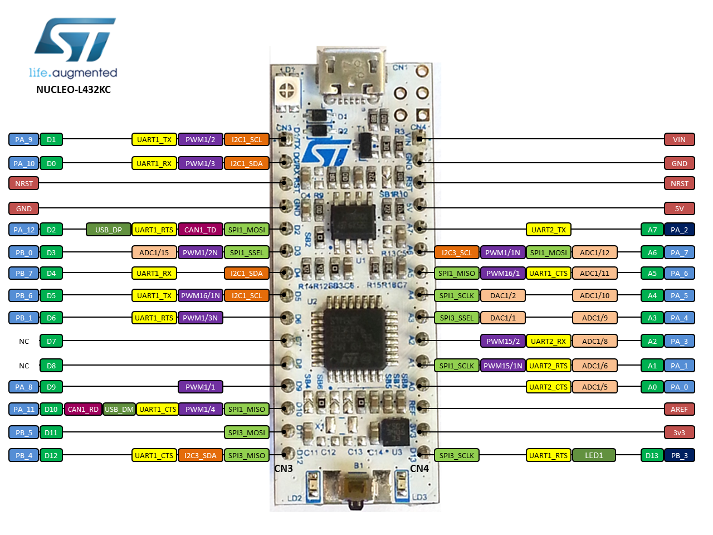
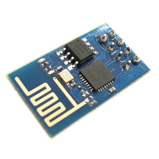
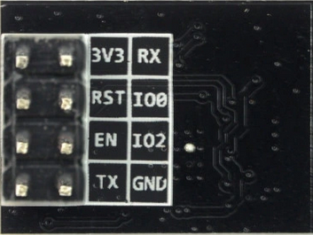

# Embedded device (developers information)

- [Introduction](#introduction)
- [Device overview](#device-overview)
    - [Development board](#development-board)
    - [Microcontroller specification](#microcontroller-specification)
    - [Firmware](#firmware)
    - [WiFi module](#wifi-module)
- [How to compile](#how-to-compile)
- [How to flash](#how-to-flash)
- [How to debug](#how-to-debug)


## INTRODUCTION

This `readme.md` file collects all the information valuable from the firmware
developer / engineer perspective. This file should provide sufficient amount
of information to start developing device firmware and test the device with
other hardware elements like sensors or WiFi module. Eventually it should
provide the very basic manual on how to connect the device with WiFi home
network.


## DEVICE OVERVIEW

### DEVELOPMENT BOARD

The development board is `NUCLEO-L432KC`, which is a very basic starter kit for
every embedded systems enthusiast. It is equipped with a `STM32L432KC`
micocontroller (target platform) and built-in `ST-Link` programmer, which
allows for easy firmware flashing without any external programmer.

Below, you can see pinout available for the user:




### MICROCONTROLLER SPECIFICATION

The microcontroller is `STM32L432KC` - ultra-low-power microcontroller from
STMicroelectronics.

**Key features**:

- **Power supply**: 1.71 [V] to 3.6 [V]

- **Core**: Arm 32-bit Cortex-M4 with FPU

- **Clock speed**: maximum 80 [MHz]

- **Flash memory**: 256 [kB]

- **SRAM memory**: 64 [kB]


### FIRMWARE

Very basic information about device firmware:

- **System architecture**: RTOS-based

- **RTOS**: FreeRTOS

- **Drivers package**: [STM32CubeL4](https://www.st.com/en/embedded-software/stm32cubel4.html)

- **Software stack**: CMSIS + LL API


### WIFI MODULE

For the time being, the WiFi module is `ESP-01 ESP8266`:





## HOW TO COMPILE

It couldn't be easier... Just run the following commands (below mentioned
commands need to be called from `workspace` directory, if you read this, you
are in a good place).

```sh
$ make clean
$ make build
```


## HOW TO FLASH

To flash firmware binary into device memory, you should run provided script
called `flash.sh`, which can be found in `scripts` directory. Before the
binary is flashed it is recompiled.

```sh
$ sh flash.sh
```


## HOW TO DEBUG

To start debugging using `arm-none-eabi-gdb` just run another script called
`debug.sh` found inside `scripts` directory. This script compiles and flashes
the binary into device memory, then establishes the connection using `openOCD`
and opens `GDB` console from the used terminal. After opening debug session is
halted at the very beginning of the program.

```sh
$ sh debug.sh
```

