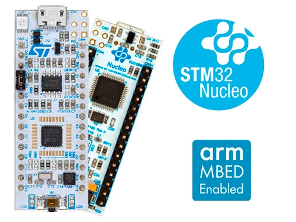

# Project XARDAS (Embedded device)

- [Introduction](#introduction)
- [Device overview](#device-overview)
- [Host system requirements](#host-system-requirements)
- [Directories hierarchy](#directories-hierarchy)
- [Programmers information](#programmers-information)
- [Other information](#other-information)

## INTRODUCTION

---
The embedded device, one of the `Project XARDAS` elements, is a small
electronic device responsible of collecting measurement data from the
environment (indoor or outdoor depending on device placement) and then sending
these data to the web application. In other words it's a very simple `IoT`
device.

## DEVICE OVERVIEW

---
So far, device is based on off-the-shelf development board `NUCLEO-L432KC`.
It's easy, fast and reliable way to develop and test firmware on a target
platform, i.e. `STM32L432KC` microcontroller. Nevertheless, there are plans to
design and assemble own PCB.

One of the crucial elements is a WiFi module used to send measurement data to
the web application. For prototype purposes `ESP-01 ESP8266` has been chosen.

## HOST SYSTEM REQUIREMENTS

---
- **Operating system**: `Linux Ubuntu 20.04` or `Mac OS`

- **Toolchain**: `GNU Arm Embedded Toolchain (Version 10-2020-q4-major)`

- **Build tool**: `Make`

## DIRECTORIES HIERARCHY

---
`embedded_device` directory consists of the following subdirectories:

- `workspace`: collects all the files related strictly with the device
   firmware, i.e. CMSIS, LL API (peripheral drivers), application code,
   compiled binaries, etc.;

- `docs`: collects all the diagrams, architecture documents, planning
   documents, etc.;

- `images`: collects all the images like pinouts, device appearance and other
   images needed for different documents.

## PROGRAMMERS INFORMATION

---
These are some basic information for programmers:

- **Style of code writing**: `snake_case` (directories and files are named
  using the same style).

## OTHER INFORMATION

---
Information like `how to compile and flash binaries` are available in the
[readme.md](./workspace/readme.md) file inside `workspace` directory.

Information will be updated as the project develops.

